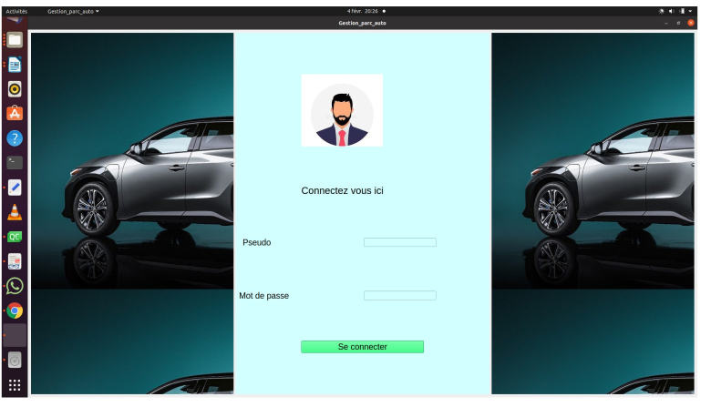

**Manuel d’utilisation du logiciel**

**A**

Après compilation du projet, on vient directement sur la
page d’authentification
Connectez vous avec les identifiants "admin" "admin"
Vous pouvez supprimer la base de donnnée pour votre utilisation

**B**

Après authentification comme ci-dessus, vous
serez renvoyer vers la page principale du choix des
opération.

**1**
Le bouton **Gérer une voiture vous** donne deux options : Supprimer une voiture ou en Ajouter une.

**Ajouter une voiture**

**Supprimer une voiture**

**2**
**Louer une voiture**

**3**

**Gérer le Retour d’une voiture**

**4**

**Avoir l’état d’une voiture**

**5**

**Avoir l’état du parc**

