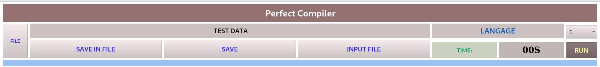
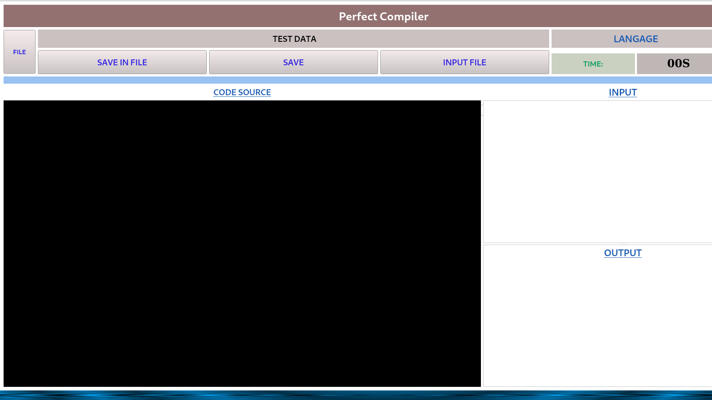

#Introduction

J'ai pensé à développer un tel logiciel en raison des difficultés de compilation des programmes sous linux. Surtout quand on est débutant !!!

# Perfect Compiler 

**Perfect Compiler** est un logiciel de compilation à IDE intégré développé pour les environnements LINUX à fin de faciliter la

compilation des programmes.

Le logiciel prend en compte pour le moment 4 languages: c, c++, python2, python3.

Le java sera prise en compte avec le temps.

Il est constitué de quatres parties.

# Première partie

Cette partie est constituée d'une Première grande bande mentionnant le nom du logiciel, en suite des boutonts permettant d'interagir avec celui ci.

# Deuxième partie

Cette partie est destinnnée au chargement du code source que vous souhaitez tourner et est éditable

# Troisième partie

Il s'agit de la zone d'affichage des entrées

# Quatrième partie

C'est la partie d'affichage de la sortie de votre programme 

# Vue générale

# NB:

Le projet est encore en pleine évolution !!!
